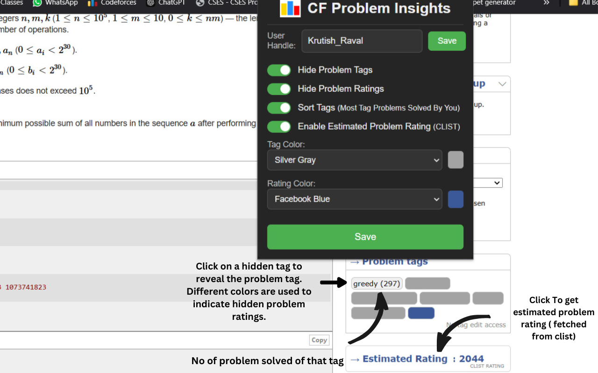
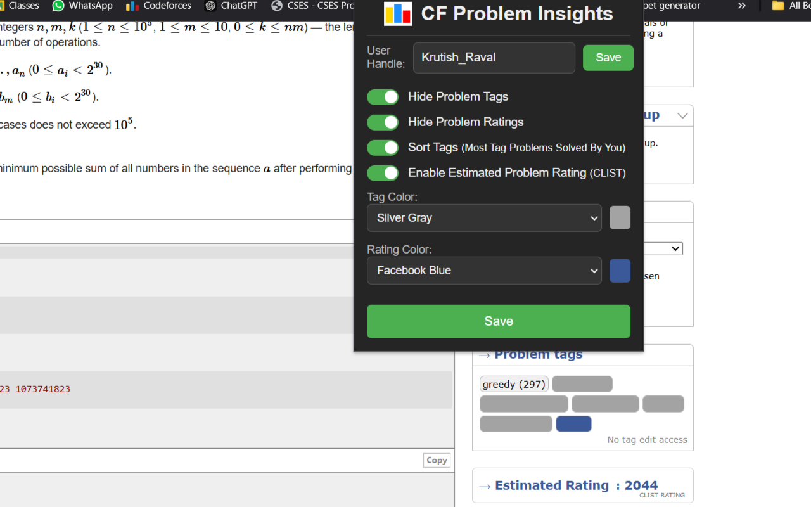

## CF Problem Insights

Codeforces Problem Enhancement Extension 🚀
Enhance your Codeforces practice experience with this powerful browser extension that adds estimated problem ratings and customizable tag visibility controls.
 

 
<h3>✨ Features</h3>

<h4>📊 Estimated Problem Ratings</h4>

Automatically fetches and displays estimated problem ratings from clist.by

<h4>🏷️ Smart Tag Management</h4>

Toggle visibility of problem tags with a single click
Customize your practice by hiding tags to avoid spoilers
Different color indicators for better visual organization
Individual tag controls - hide or show specific tags as needed

<h4>🎯 Rating Controls</h4>
 
Option to hide problem ratings for focused practice
 
Reveal ratings when you're ready to assess difficulty
 
clean interface integration with Codeforces

<h3>🚀 Installation<h3>

Visit the <a href="https://chromewebstore.google.com/detail/cf-problem-insights/jpelkcdgakhmabljokpfjjpinlmpmaki?authuser=0">Chrome Web Store</a>
 
Click "Add to Chrome" 
The extension will automatically appear in your browser toolbar

<h3>🔧 Usage</h3>
<h4>Estimated Ratings</h4>

Navigate to any Codeforces problem
The estimated rating will automatically appear below to Problem Tags

<h4>Managing Tags</h4>
 
Click the tag icon next to any problem
Use individual toggles to show/hide specific tags
Use the "Hide All" or "Show All" buttons for quick controls

<h4>Rating Visibility</h4>

Click the rating toggle button
Choose to show or hide all ratings

<h3>🖥️ Screenshots<h3>
 
 
<h4>Screenshot 1:-</h4>
 
 

 
 
<h4>Screenshot 2:-</h4>
 
 

 
 
<h3>🤝 Contributing</h3>
 
Contributions are welcome! Here's how you can help:
 
Fork the repository
 
Create a new branch (git checkout -b feature/improvement)
 
Make your changes
 
Commit your changes (git commit -am 'Add new feature')
 
Push to the branch (git push origin feature/improvement)
 
Create a Pull Request
 
 
<h3>Tools and Technologies Used</h3>
 
Programming Languages: JavaScript (Vanilla)
 
Extensions Platform: Manifest V3
 
 
<h3>🙏 Acknowledgments<h3>
 
Thanks to clist.by for providing problem rating data
Special thanks to all contributors and users

<h3>📞 Support</h3>

Create an issue in the GitHub repository
Contact: [ksraval710@gmail.com]

Made with ❤️ for the competitive programming community
